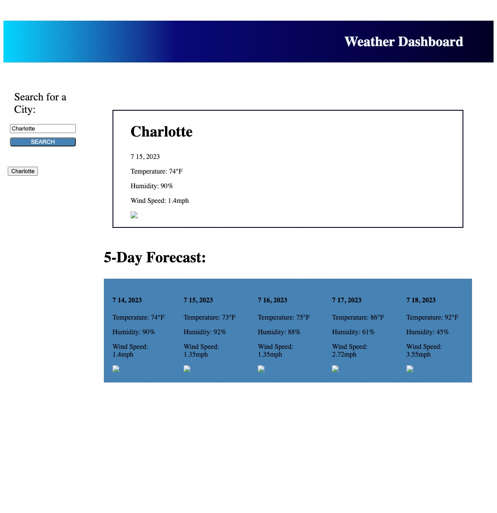

# Weather Dashboard

 

## Description

This project was created to practice using APIs in an application. The Open Weather API was used to pull a five day forecast report for a specified city. This project taught me a lot about how to get an API key and use it based on the specific information I need to access. I found this project to be enjoyable and I feel like working with APIs are pretty fun. It is very interesting how much data can be accessed without researching it manually. I find APIs to be extremely convenient and the documentation for the Open Weather API was fairly simple to follow along. 

 

## Technology Used

- HTML - used to edit the existing elements.
- CSS - used to edit the styling for the html elements.
- Javascript - used to add function the application.
- Git - used to track edits made to the source code.
- GitHub - used to host and deploy the repository.

 

| Technology Used         | Resource URL           | 
| ------------- |-------------| 
| Format Day.js  | [https://day.js.org/docs/en/display/format](https://day.js.org/docs/en/display/format) | 
| Open Weather API    | [https://openweathermap.org/forecast5#other](https://openweathermap.org/forecast5#other)      |   
| Using the Fetch API | [https://developer.mozilla.org/en-US/docs/Web/API/Fetch_API/Using_Fetch](https://developer.mozilla.org/en-US/docs/Web/API/Fetch_API/Using_Fetch) | 
| Math.round()  | [https://developer.mozilla.org/en-US/docs/Web/JavaScript/Reference/Global_Objects/Math/round](hhttps://developer.mozilla.org/en-US/docs/Web/JavaScript/Reference/Global_Objects/Math/round) | 

 

## Deployment

Website URL: [Weather Dashboard](https://laineycreighton.github.io/weather-dashboard/)

Navigating to the website URL should present you with the following:

  
   

## Author Info

### Lainey Creighton

*Currently a student in the UC Berkley Full Stack Flex Bootcamp. Contact Below:* 

* [Portfolio](https://laineycreighton.github.io/portfolio/)
* [LinkedIn](https://www.linkedin.com/in/lainey-creighton/)
* [Github](https://github.com/laineycreighton)

 

## License

N/A